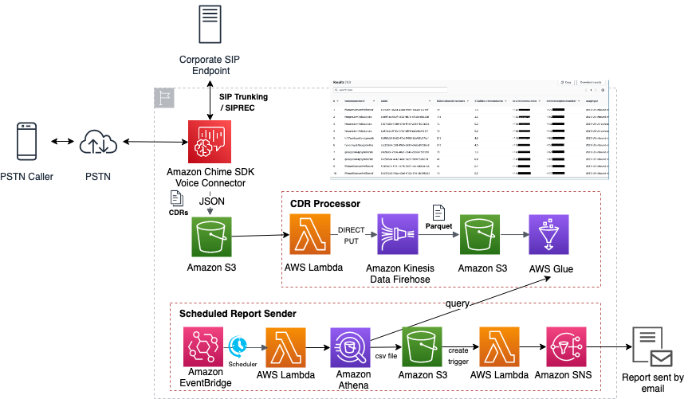
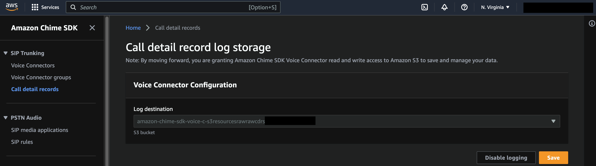
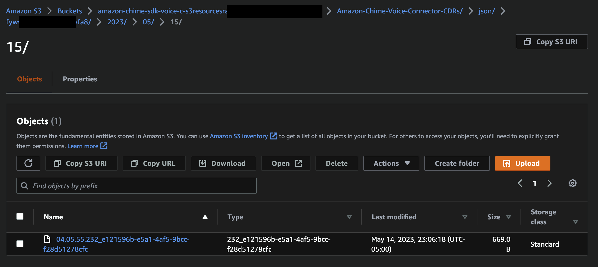
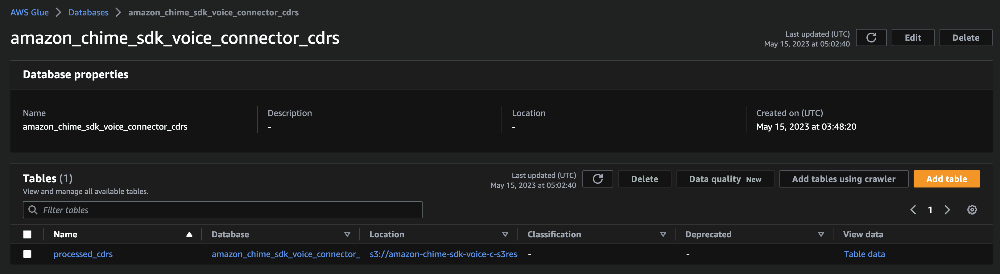
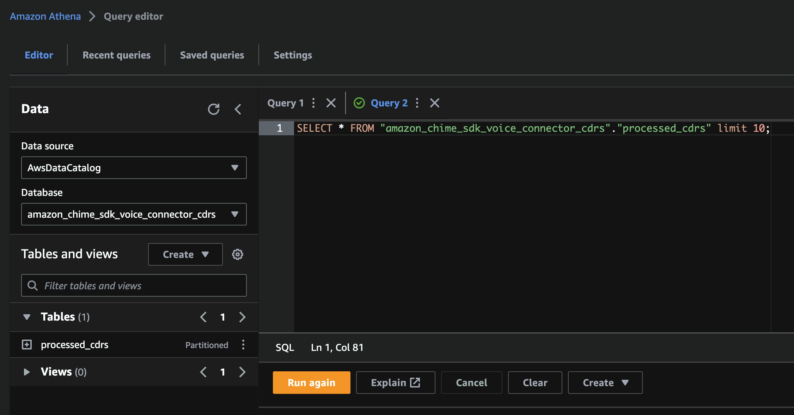

# Amazon Chime SDK CDR Processor



## Overview

In this demo we will show how to use Amazon Kinesis Data Firehose to process Call Detail Records generated by an Amazon Chime SDK Voice Connector [from JSON to Apache Parquet](https://docs.aws.amazon.com/firehose/latest/dev/record-format-conversion.html). This conversion will result in faster queries of the data using something like [Amazon Athena](https://aws.amazon.com/athena/).

* This version of the demo adds additional layer that schedules to send a customizable CDR report to an email address recurringly. How to configure the settings for these are explained at the Deploying section. 

## Prerequisites

- Basic understanding of telephony
- Basic understanding of Python
- Ability to deploy AWS Cloud Development Kit (AWS CDK)

## How It Works

When a call using Amazon Chime SDK Voice Connector completes, if call detail record log storage is enabled, a JSON file is written to Amazon Simple Storage Service (Amazon S3).

### Configuring call detail records

To enable call detail record log storage for your Amazon Chime SDK Voice Connectors, navigate to the Amazon Chime SDK console and select Call detail records.



Select an existing bucket and Save.

### Call detail records

Now, when a call completes, a JSON file (there will be no file extension) will be written to the selected bucket using the following prefix format: Amazon-Chime-Voice-Connector-CDRs/json/`VOICE_CONNECTOR_ID`/`YEAR`/`MONTH`/`DATA`



### Triggered Lambda Function

This demo will create an AWS Lambda function that triggers when an object is written to the designated S3 bucket. This Lambda function will put read the object and validate that it is a valid record. If it is, it will put this record onto the Amazon Kinesis Data Firehose.

```python
def handler(event, context):
    global LOG_PREFIX
    LOG_PREFIX = 'CDR Generation Notification: '

    s3_bucket = event['Records'][0]['s3']['bucket']['name']
    s3_object_key = event['Records'][0]['s3']['object']['key']

    s3_object = s3.get_object(Bucket=s3_bucket, Key=s3_object_key)
    data = s3_object['Body'].read().decode('utf-8')

    record = json.loads(data)
    validated_record = validate_record(record)

    if validated_record:
        logger.info('%s Record: %s', LOG_PREFIX, validated_record)
        firehose.put_record(DeliveryStreamName=KINESIS_STREAM, Record={'Data': json.dumps(validated_record)})
        print(f'Successfully processed file: {s3_object_key}')
    else:
        logger.error('%s Invalid Record: %s', LOG_PREFIX, record)
```

### Amazon Kinesis Data Firehose

When this record is put to the Amazon Kinesis Data Firehose, it will be buffered and the delivered to Amazon S3 bucket based on the [Buffer size and Buffer interval](https://docs.aws.amazon.com/firehose/latest/dev/basic-deliver.html#frequency). This demo allows you to configure those through environment variables. The Amazon Kinesis Data Firehose is configured to transform the record from a JSON object to an Apache Parquet output using an AWS Glue database and table. Additionally, this destination is enabled with [Dynamic Partitioning](https://docs.aws.amazon.com/firehose/latest/dev/dynamic-partitioning.html). This allows the data to be more efficiently scanned and analyzed.

The data written to the the processed CDR bucket will be in this format: `Amazon-Chime-Voice-Connector-CDRs/year=!{partitionKeyFromQuery:year}/month=!{partitionKeyFromQuery:month}/day=!{partitionKeyFromQuery:day}/`

### AWS Glue

An AWS Glue database and table will be created as part of this demo. The database will consist of a single table associated with the processed CDRs.



This table will consist of the [Amazon Chime SDK Voice Connector CDR](https://docs.aws.amazon.com/chime-sdk/latest/dg/attributes.html) schema.

### Using these records

Now that the CDRs have been written to a new S3 bucket in an Apache Parquet format, we can more easily query them. In this demo, we will show you how to query them using Amazon Athena.



After selecting `AwsDataCatalog` as the Data source and `amazon_chime_sdk_voice_connector_cdrs` as the Database, you should see the `processed_cdrs` Table. By selecting `Preview Table` you can see an example of the records that have been written to this Table. More extensive querying can be done using [Athena SQL](https://docs.aws.amazon.com/athena/latest/ug/using-athena-sql.html).

## Deploying

This demo includes a `.env` file that can be configured as needed but includes defaults that should allow you to quickly deploy:

- LOG_LEVEL: the level of logging - Default: INFO
- REMOVAL_POLICY: determines if the buckets created will be kept or destroyed if the CDK is destroyed - Default: Destroy
- RAW_CDRS_BUCKET: if you have an existing CDR bucket, you can use that here, otherwise a new bucket will be created - Default: ''
- PROJECTION_YEAR_MIN: the first year used in the dynamic partition projection - Default: 2023
- PROJECTION_YEAR_MAX: the last year used in the dynamic partition projection - Default: 2026
- BUFFER_HINT_SIZE: the size in Mb used for buffering the Kinesis Data Firehose - Default: 128
- BUFFER_HINT_INTERVAL: the time in seconds used for buffer the Kinesis Data Firehose - Default: 300
- ATHENA_QUERY: SQL query that will be sent to retrieve CDR data - Default: see amazon-chime-sdk-voice-connector-cdr-processor.ts
- CRON: [cron rule](https://docs.aws.amazon.com/eventbridge/latest/userguide/eb-cron-expressions.html) that runs to send report on a schedule - Default: cron(0 0 1 * ? *) //once a month
- EMAIL: email address that the report will be sent to - Default: ''

The included sample `.env` looks like this:

```text
LOG_LEVEL='INFO'
BUFFER_HINT_INTERVAL='60'
ATHENA_QUERY="SELECT voiceconnectorId, SUM(billabledurationseconds) as billabledurationseconds, SUM(billabledurationminutes) as billabledurationminutes, month, year FROM {database}.{table} WHERE (year = YEAR(CURRENT_DATE) AND month = MONTH(CURRENT_DATE) ) group by voiceconnectorid, month, year;"
CRON="cron(*/15 * * * ? *)"
EMAIL='****@amazon.com'
```

Once configured, you can deploy by using:

```
yarn launch
```

### Cleanup

To destroy this stack:

```
yarn cdk destroy
```
