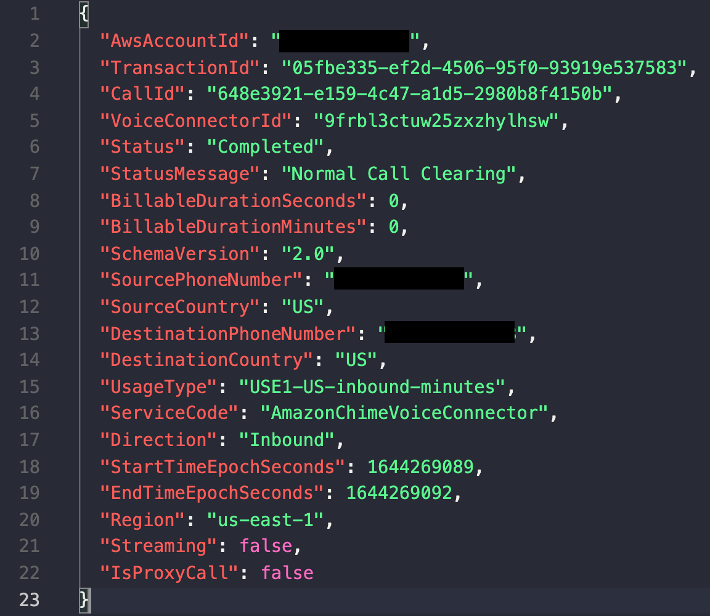
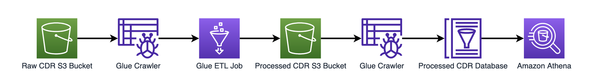
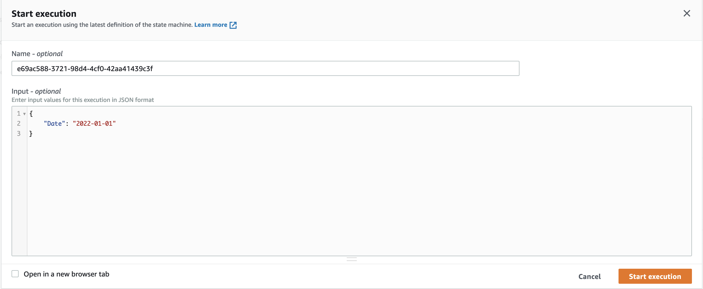
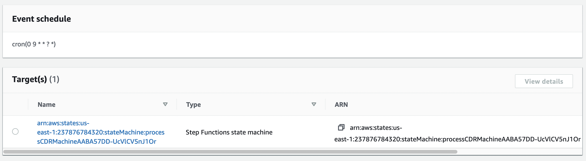
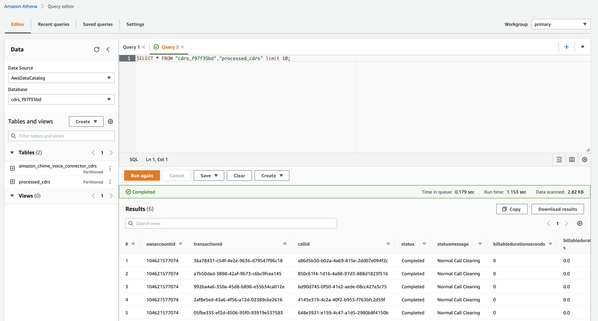
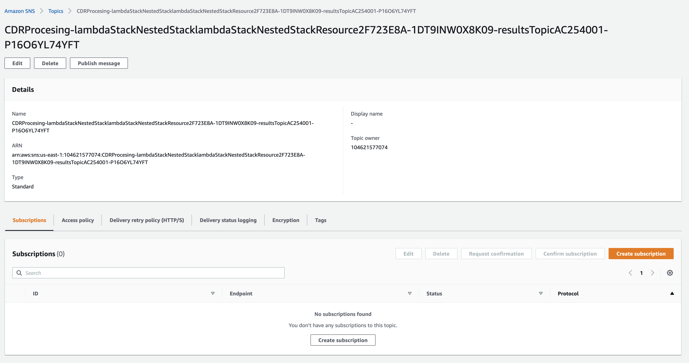
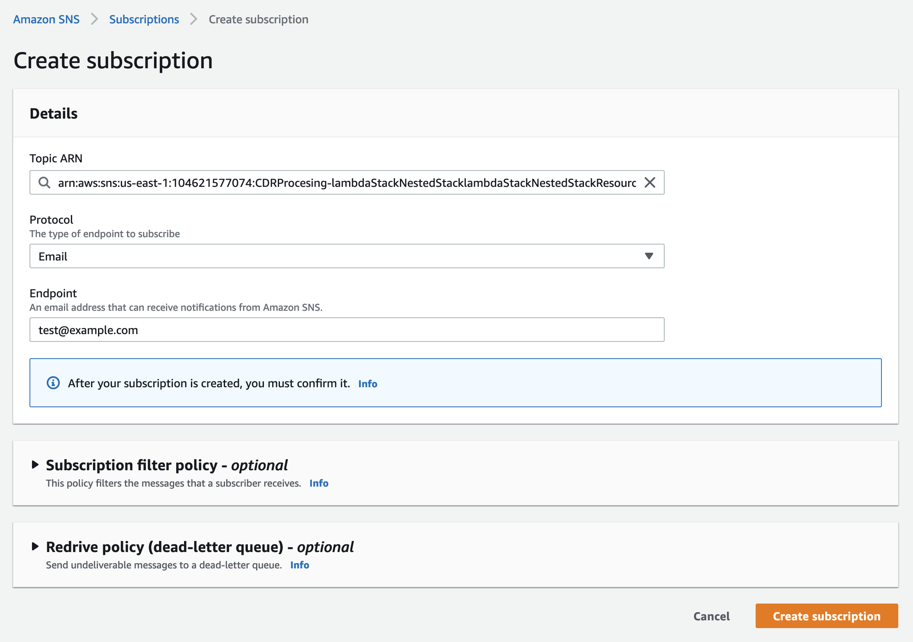

# Amazon Chime Voice Connector CDR Processing

If enabled, Amzon Chime Voice Connector will produce [CDRs](https://docs.aws.amazon.com/chime/latest/dg/attributes.html). These CDRs will be stored in a designated S3 bucket with the following prefixes:
`s3://s3_bucket_name/Amazon-Chime-Voice-Connector-CDRs/json/VOICECONNECTORID/YEAR/MONTH/DATE/`

Each call will generate a separate JSON file that looks similar to this:


If your account is generating a large number of CDRs per day, it can be difficult and time consuming to search these records for accurate information. This starter project will help you set up AWS resources to make querying that data faster and easier.

### AWS Glue Configuration

This starter project will deploy several AWS Glue resources. These resources will be used to [Extract, Transform, and Load](https://docs.aws.amazon.com/glue/latest/dg/what-is-glue.html) (ETL) your data from a JSON file in S3 to a queryable database that can be used by [Amazon Athena](https://docs.aws.amazon.com/athena/latest/ug/getting-started.html) to quickly and easily search CDRs using SQL.

AWS Glue will be used to Crawl the original Amazon Simple Storage Service (Amazon S3) bucket CDRs, convert them to Parquet formatted files using ETL, and then Crawl them again to create a Database that can be used by Amazon Athena to query the records. Converting to Parquet from separate JSON files greatly increases the efficiently of querying your CDRS.



The three main Glue components will be called daily:

- Crawl raw CDRs
- ETL the raw CDRs into Parquet formatted CDRs
- Crawl processed CDRs

Each of the Crawls use the `CRAWL_NEW_FOLDERS_ONLY` option to inspect only newly created folders. The daily ETL will use a [pushdown predicate](https://docs.aws.amazon.com/glue/latest/dg/aws-glue-programming-etl-partitions.html#aws-glue-programming-etl-partitions-pushdowns) to limit the scope of the ETL to only the previous day's records or the date requested.

If you have a large number of existing records, the inital crawl of these records can take a very long time. If this is the case, you may want to create a new S3 bucket for new records and use a different bucket for older records. As part of this deployment, a separate S3 bucket can be designated as the full CDR bucket and a seperate process will be created that will `CRAWL_EVERYTHING`. Depending on the size of this bucket, this process can be lengthy.

### AWS Step Functions

Depending on the quantity of data being processed, some of these ETL jobs can run for several hours. In order to run for this length of time, [AWS Step Functions](https://aws.amazon.com/step-functions/use-cases/#Data_Processing_and_ETL_Orchestration) are used. Once an AWS Glue Crawl operation is started, the AWS Step Functions will check to see if it has completed. If it has, the Step Function will move on to the next step. If it has not, it will wait and then check again. Once the Crawl operation has been completed, the Step Function will start the ETL process using the same logic. Once the ETL has completed, another Crawl will be started on the processed data. When all are completed, an SNS message will be sent to a Topic to confirm that everything has completed.

The `processCDR` Step Function can also be invoked manually with a specified date. This will start the Step Function using the Date as input to process that day's data. Within the Step Function [console](https://console.aws.amazon.com/states/home?region=us-east-1#/statemachines) select the processCDR State Machine and Start Execution:



Three separate AWS Step Functions are created as part of this deployment:

- Daily ETL Job
- Full ETL Job
- Monthly Report Job

The Daily ETL and Monthly Report jobs will run automatically on a schedule designated by an EventBridge cron job.

### Amazon EventBridge

To schedule the AWS Step Functions to run daily, Amazon EventBridge is used. EventBridge will create a cron job that will run the CDR Processing Step Function once a day and the CDR Report Generation once a month.

The cron job for the daily CDR processing AWS Step Function will be run at 9 UTC as shown here:


### Amazon Athena

Once the CDRs have been converted from a raw JSON file to a more efficiently queried parquet file, Amazon Athena can be used to query this data. As part of the AWS Glue process, the processed data will be Crawled by Glue to create a database. This database can be queried with standard SQL syntax to find the data you're looking for.

For example to query all records and group by NPANXX:

```
SELECT npanxx, SUM(TotalDuration) AS TotalDuration, COUNT(CallCount) AS CallCount FROM (SELECT npanxx, SUM(duration) AS TotalDuration, COUNT(callid) AS CallCount FROM cdrs_70ef0eb6.processed_cdrs GROUP BY  npanxx) GROUP BY  npanxx
```



Two Tables should appear in the Database that was created.

- amazon_chime_voice_connector_cdrs
- processed_cdrs

The first Table is the raw, unprocessed CDRs that cannot be easily queryed. The second is the processed CDRs that can be queried by Amazon Athena as demonstrated above.

### Monthly Report

In addition to the daily CDR processing, EventBridge will be used to create a monthly report. This report will use Amazon Athena to query the month's worth of data to produce a report. This report wil be stored in an S3 bucket as a CSV file and can be dowloaded as needed. An Amazon Simple Notification Service (SNS) notification will also be sent with pre-signed URL to download this file when the report has been created. To receive this notification, log on to the [SNS AWS Console](https://console.aws.amazon.com/sns) and create a subscription for email delivery.




### Deployment

```
yarn
yarn configure
```

This will walk you through a deployment script to choose the S3 buckets to use for daily and full ETL processes.

1. Confirm the currently configured CDR bucket. This script will query your account and return the currently configured bucket.
2. Request input for the number of ETL workers to use for the daily ETL job. The default is 10.
3. Request input for the number of ETL workers to use for the full ETL job. The default is 100.
4. Query if an additional bucket will be used. This would typically be a bucket of older CDRs that is not included in the current CDR bucket.
5. Query if a Full Crawl should be run. If using an additional bucket (as defined above), the Full Crawl will be performed on that. Otherwise, the Full Crawl will be performed on the current CDR Bucket.

Please note: The costs incured will be impacted by the size of the data that is being processed and the number of workers used to process this data and can be significant. Please see [AWS Glue Pricing](https://aws.amazon.com/glue/pricing/) for more details.

These Crawls and ETL jobs can be run at any time through the [AWS Glue console](https://console.aws.amazon.com/glue/) and [AWS Step Functions](https://console.aws.amazon.com/states) console.

```
yarn launch
```

Once configured, the CDK can be deployed.

### Destroy

```
yarn destroy
```

This will destroy all resources created by the CDK but will not remove the configured CDR bucket.
